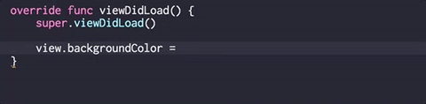

# CSS3ColorsSwift

[](https://doge.mit-license.org)
[](https://swift.org)
[](https://github.com/Carthage/Carthage)
[](http://cocoadocs.org/docsets/CSS3ColorsSwift/)
[](https://github.com/matteocrippa/awesome-swift#colors)

## Overview
`CSS3ColorsSwift` provides a UIColor extension with Web Color names.


## Demo
Run the demo project in the Demo directory without `carthage update` or `pod install`.

## Usage

You can write Web Color as described below:

```swift
let color1 = UIColor.ivory

let color2: UIColor = .mediumSlateBlue

view.backgroundColor = .lightCoral
```

You can see also all colors in Demo project.

|Property|Color|
|:--|:--|
|.whiteSmoke|#F5F5F5|
|.ghostWhite|#F8F8FF|
|.aliceBlue|#F0F8FF|
|.lavender|#E6E6FA|
|.azure|#F0FFFF|
|.lightCyan|#E0FFFF|
|.mintCream|#F5FFFA|
|.honeyDew|#F0FFF0|
|.ivory|#FFFFF0|
|.beige|#F5F5DC|
|.lightYellow|#FFFFE0|
|.lightGoldenRodYellow|#FAFAD2|
|.lemonChiffon|#FFFACD|
|.floralWhite|#FFFAF0|
|.oldLace|#FDF5E6|
|.cornSilk|#FFF8DC|
|.papayaWhip|#FFEFD5|
|.blanchedAlmond|#FFEBCD|
|.bisque|#FFE4C4|
|.snow|#FFFAFA|
|.linen|#FAF0E6|
|.antiqueWhite|#FAEBD7|
|.seaShell|#FFF5EE|
|.lavenderBlush|#FFF0F5|
|.mistyRose|#FFE4E1|
|.gainsboro|#DCDCDC|
|.lightGrayCSS3|#D3D3D3|
|.lightSteelBlue|#B0C4DE|
|.lightBlue|#ADD8E6|
|.lightSkyBlue|#87CEFA|
|.powderBlue|#B0E0E6|
|.paleTurquoise|#AFEEEE|
|.skyBlue|#87CEEB|
|.mediumAquamarine|#66CDAA|
|.aquamarine|#7FFFD4|
|.paleGreen|#98FB98|
|.lightGreen|#90EE90|
|.khaki|#F0E68C|
|.paleGoldenRod|#EEE8AA|
|.moccasin|#FFE4B5|
|.navajoWhite|#FFDEAD|
|.peachPuff|#FFDAB9|
|.wheat|#F5DEB3|
|.pink|#FFC0CB|
|.lightPink|#FFB6C1|
|.thistle|#D8BFD8|
|.plum|#DDA0DD|
|.silver|#C0C0C0|
|.darkGrayCSS3|#A9A9A9|
|.lightSlateGray|#778899|
|.slateGray|#708090|
|.slateBlue|#6A5ACD|
|.steelBlue|#4682B4|
|.mediumSlateBlue|#7B68EE|
|.royalBlue|#4169E1|
|.dodgerBlue|#1E90FF|
|.cornflowerBlue|#6495ED|
|.deepSkyBlue|#00BFFF|
|.aqua|#00FFFF|
|.turquoise|#40E0D0|
|.mediumTurquoise|#48D1CC|
|.darkTurquoise|#00CED1|
|.lightSeaGreen|#20B2AA|
|.mediumSpringGreen|#00FA9A|
|.springGreen|#00FF7F|
|.lime|#00FF00|
|.limeGreen|#32CD32|
|.yellowGreen|#9ACD32|
|.lawnGreen|#7CFC00|
|.chartreuse|#7FFF00|
|.greenYellow|#ADFF2F|
|.gold|#FFD700|
|.orangeCSS3|#FFA500|
|.darkOrange|#FF8C00|
|.goldenRod|#DAA520|
|.burlyWood|#DEB887|
|.tan|#D2B48C|
|.sandyBrown|#F4A460|
|.darkSalmon|#E9967A|
|.lightCoral|#F08080|
|.salmon|#FA8072|
|.lightSalmon|#FFA07A|
|.coral|#FF7F50|
|.tomato|#FF6347|
|.orangeRed|#FF4500|
|.deepPink|#FF1493|
|.hotPink|#FF69B4|
|.paleVioletRed|#D87093|
|.violet|#EE82EE|
|.orchid|#DA70D6|
|.fuchsia|#FF00FF|
|.mediumOrchid|#BA55D3|
|.darkOrchid|#9932CC|
|.darkViolet|#9400D3|
|.blueViolet|#8A2BE2|
|.mediumPurple|#9370D8|
|.mediumBlue|#0000CD|
|.darkCyan|#008B8B|
|.cadetBlue|#5F9EA0|
|.darkSeaGreen|#8FBC8F|
|.mediumSeaGreen|#3CB371|
|.teal|#008080|
|.forestGreen|#228B22|
|.seaGreen|#2E8B57|
|.darkKhaki|#BDB76B|
|.peru|#CD853F|
|.crimson|#DC143C|
|.indianRed|#CD5C5C|
|.rosyBrown|#BC8F8F|
|.mediumVioletRed|#C71585|
|.dimGray|#696969|
|.midnightBlue|#191970|
|.darkSlateBlue|#483D8B|
|.darkBlue|#00008B|
|.navy|#000080|
|.darkSlateGray|#2F4F4F|
|.greenCSS3|#008000|
|.darkGreen|#006400|
|.darkOliveGreen|#556B2F|
|.oliveDrab|#6B8E23|
|.olive|#808000|
|.darkGoldenRod|#B8860B|
|.chocolate|#D2691E|
|.sienna|#A0522D|
|.saddleBrown|#8B4513|
|.fireBrick|#B22222|
|.brownCSS3|#A52A2A|
|.maroon|#800000|
|.darkRed|#8B0000|
|.darkMagenta|#8B008B|
|.indigo|#4B0082|

## Requirements
- Swift 3.0.1
- iOS 9.0 or later

## Installation
### Carthage
CSS3ColorsSwift is available through [Carthage](https://github.com/Carthage/Carthage). To install it, simply add the following line to your Cartfile:

```
github "WorldDownTown/CSS3ColorsSwift"
```

### CocoaPods
CSS3ColorsSwift is available through [CocoaPods](http://cocoapods.org). To install it, simply add the following line to your Podfile:

```ruby
swift_version = '3.0.1'

...

pod 'CSS3ColorsSwift'
```

### Manually
1. Download and drop `/CSS3ColorsSwift` folder in your project.
2. Congratulations!


## Xcode Snippets

You can install code snippets of Color Literal for Xcode 8.



### Installation

```shd
# bash, zsh
$ git clone https://github.com/WorldDownTown/CSS3ColorsSwift.git && cp CSS3ColorsSwift/XcodeSnippets/*.codesnippet ~/Library/Developer/Xcode/UserData/CodeSnippets/

# fish
$ git clone https://github.com/WorldDownTown/CSS3ColorsSwift.git; and cp CSS3ColorsSwift/XcodeSnippets/*.codesnippet ~/Library/Developer/Xcode/UserData/CodeSnippets/
```

### Uninstallation

```shd
$ rm ~/Library/Developer/Xcode/UserData/CodeSnippets/CSS3ColorsSwift*.codesnippet
```

## Author
WorldDownTown, WorldDownTown@gmail.com

## License
CSS3ColorsSwift is available under the MIT license. See the LICENSE file for more info.

